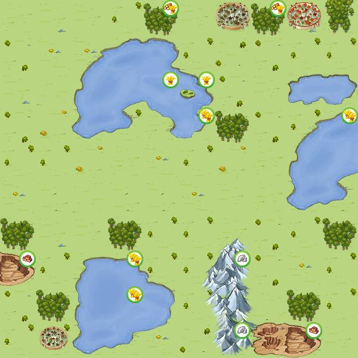

Program fetches map tiles (images) from Travian server and analyzes them to find different village types (15c/9c etc.) and oasis. Unfortunately, travian does not allow fetching images if the user isn't logged in (you would need to add a token to the request in order for this program to work on version t4.5 as well). On previous version this program could analyze whole map before the server even started (map generated ~1 day before the start of the server), which made it very useful for big teams to chose their starting coordinates. 

#### How it works
This program fetches image tiles and compares them with images of different village type images and oasis (you can find all images of different village type(9c, 15c, 4446 etc) in data folder). Then it just checks how many 25% and 50% crop oasis are around each 15c and displays the coordinates in the program.

#### Is it still useful?
Haven't tried on t5, but I doubt it would work. If you add token with the request the program would work again. You could also add features for example searching for all 4536 with 25% clay oasis near your capital (if you are playing gauls).

#### How program looks like

#### Tile image example

This is an example tile that your browser fetches from Travian server when you move around the map. You can see these tiles if you inspect your browser and go under "Network" tab. 